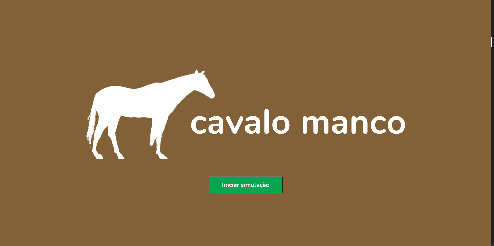
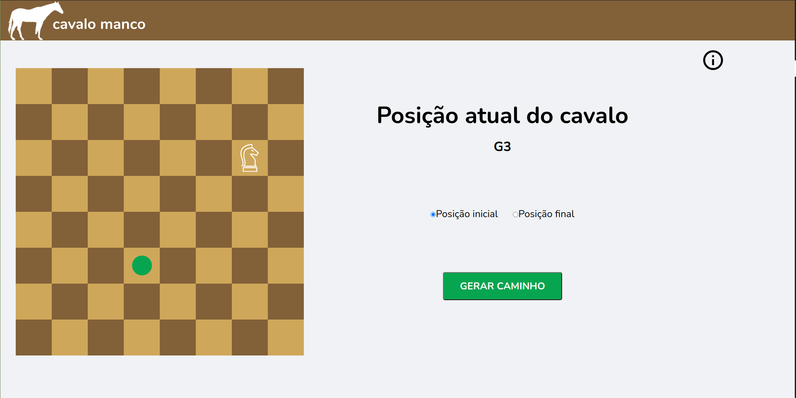
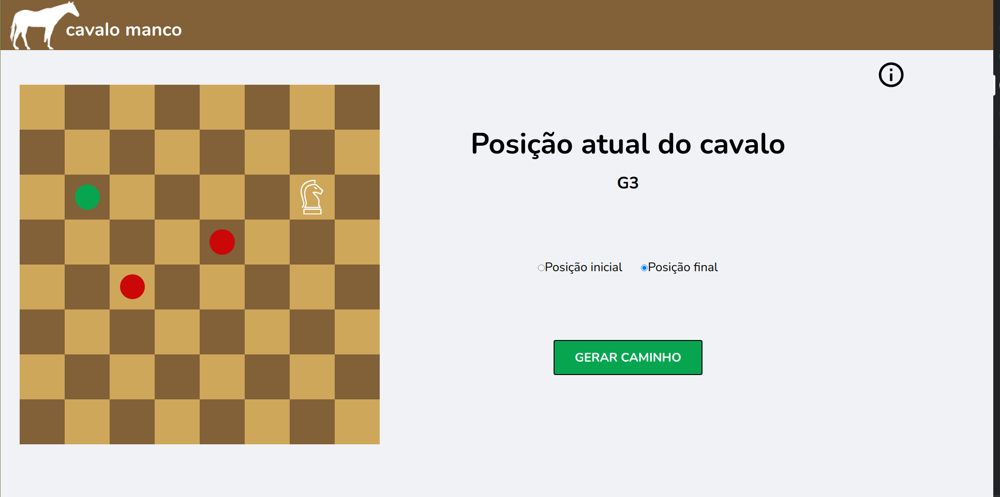

# Final_Lame_Horse

# Cavalo Manco

**Conteúdo da Disciplina**: Programação Dinâmica + Grafos<br>

## Alunos
|Matrícula | Aluno |
| -- | -- |
| 17/0139981 |  Danillo Gonçalves de Souza |
| 17/0013910 |  Joao Pedro Jose Santos da Silva Guedes |

## Sobre 
O objetivo do projeto é a aplicação dos conteúdos da disciplina Projeto de Algoritmos em um contexto real. O contexto selecionado pela dupla foi medir calcular a menor distância que um cavalo deve percorrer até uma casa qualquer no tabuleiro de xadrez. Por trás desta plataforma estão sendo aplicados conceitos de  **Programação Dinâmica e Grafos**.

## Screenshots





## Instalação 
**Linguagem**: TypeScript<br>
**Framework**: ReactJS<br>
Para rodar o projeto você precisará instalar na sua máquina:
- [Node.js](https://nodejs.org/en/)
- [Yarn](https://yarnpkg.com/)

Para rodar o projeto basta executar os seguintes comandos

**Utilizando yarn**
```
yarn
yarn start
```
## Uso 
Após executar automaticamente ele abrirá uma aba no seu navegador com o projeto rodando, caso isto não aconteça basta acessar seu localhost com a porta indicada no terminal ao executar os comandos.
